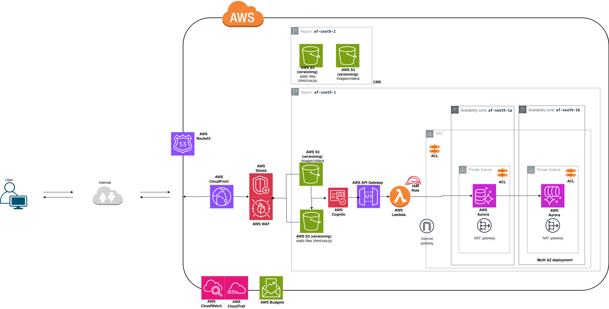

# SAA‑Ecommerce‑Portal 🛒☁️

This personal project delivers a low‑latency, highly available, and secure e‑commerce portal for African customers, complete with relational user data storage and image hosting. Built in week 2 of my AWS SAA program, it demonstrates cloud architecture best practices under budget constraints.

---

## 🚀 Project Overview

- **Goal:** Design an online storefront that
  1. Serves pages and images with minimal latency  
  2. Persists user profiles and order history in a secure relational store  
  3. Scales automatically, with built‑in fault tolerance  
  4. Encrypts data at rest and in transit, with strict access controls  
  5. Implements monitoring, logging, and cost optimization  

---

## 🧱 Architecture Diagram

  

_Key components_  
1. **Edge CDN (CloudFront):** Caches static assets (product images, frontend(html, CSS, JS)) at edge locations across Africa (`Lagos`, `Nairobi`, `Johannesburg` and `Cape Town`).  
2. **API Gateway + Lambda:** Serverless front door for dynamic requests; scales on demand, zero server management.  
3. **Aurora Serverless (PostgreSQL):** Auto‑scaling relational database for user profiles and orders.  
4. **S3 + CloudFront:** Versioned and encrypted buckets for static frontend, product images, behind a secure CDN.  
5. **WAF & Shield:** Protect against DDoS and OWASP Top 10 web exploits.  
6. **VPC + Private Subnets:** RDS live in private subnets, with NAT for outbound updates.  
7. **Cognito:** User authentication and fine‑grained IAM access.  
8. **CloudWatch & CloudTrail:** Real‑time metrics, centralized logs, and distributed audits and compliance.  
9. **Cost Controls:** Budget alarms, rightsizing recommendations, and reserved concurrency caps.

---

## 🛠️ Implementation Highlights

| Concern          | Solution                                         | Benefit                   |
|------------------|--------------------------------------------------|---------------------------|
| **Latency**      | CloudFront at regional edge locations            | < 100 ms page loads       |
| **Availability** | Aurora Serverless + multi‑AZ deployment          | 99.99% uptime             |
| **Scalability**  | API Gateway + Lambda on demand                   | Instant auto‑scaling      |
| **Security**     | TLS (client to server encryption), AWS KMS‑encrypted S3 & RDS volumes  | Data fully encrypted |
| **Access Control**| Cognito for auth + IAM roles for service access | Least‑privilege enforced  |
| **Monitoring**   | CloudWatch metrics + CloudTrail audits           | Proactive issue spotting  |
| **Cost**         | Auto‑pause Aurora, budgets and alarms | Cost predictability |

---

## 🔒 Security & Compliance

- **Encryption at Rest:** AWS KMS‑managed keys for RDS and S3.  
- **Encryption in Transit:** TLS 1.2+ enforced via CloudFront and API Gateway.  
- **Web Protection:** AWS WAF ruleset + Shield Advanced for DDoS protection.  
- **IAM Best Practices:** Role‑based access, no root usage, MFA enforced.  

---

## 📈 Observability

- **Dashboards:** CloudWatch custom dashboards for latency, error rates, and cost.  
- **Logs:** Centralized application logs in CloudWatch Logs, with retention policies.  
- **Auditing:** AWS CloudTrail enables governance, compliance, operational auditing, and security of ecommerce workloads.  

---

## 💡 Next Steps

- For the sake of this project, I'll keep updating this architecture based on further itterative requirements while i go extra creative with my other personal projects. Thank you 😉.
